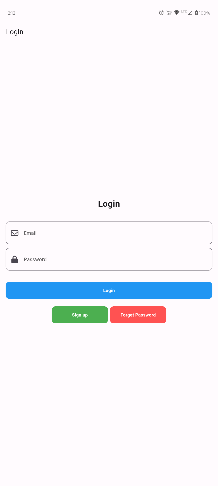
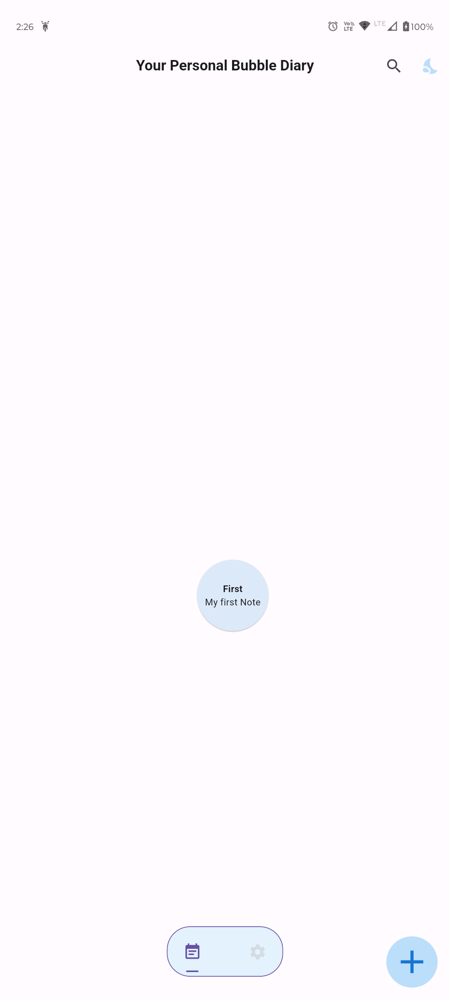
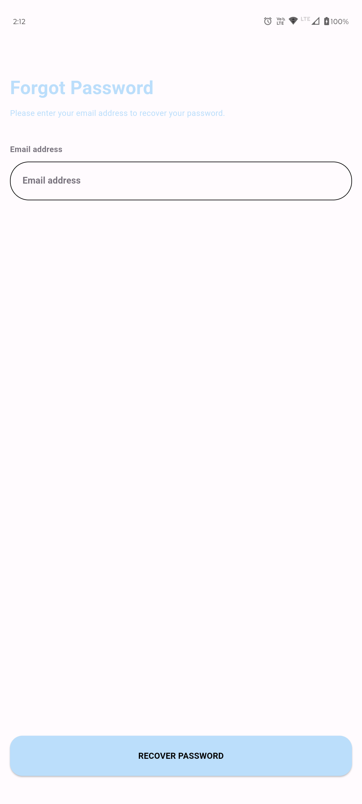
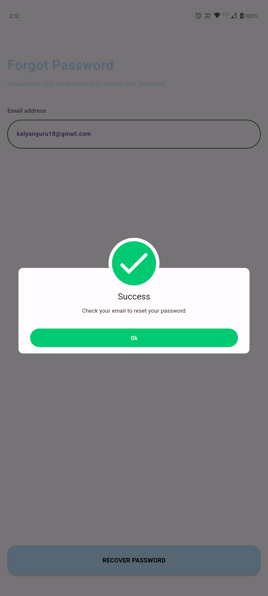
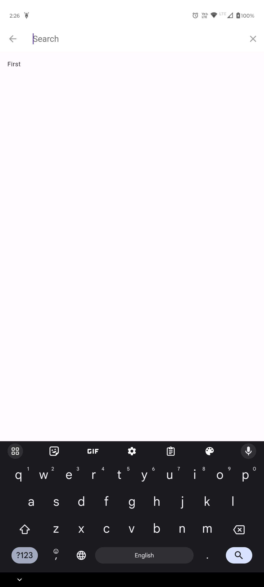
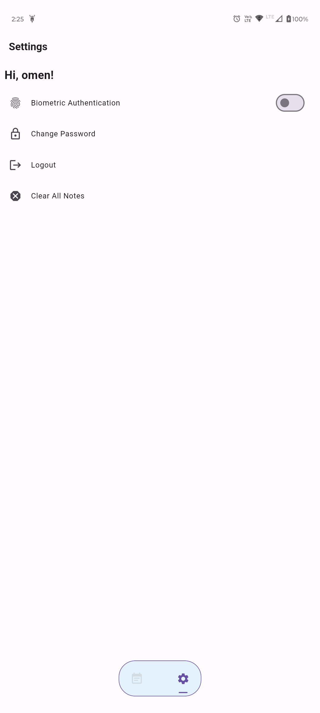
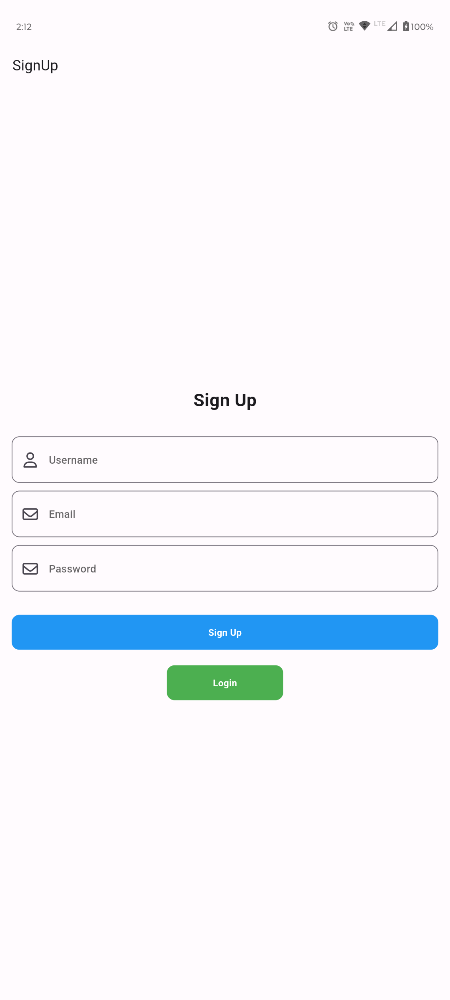
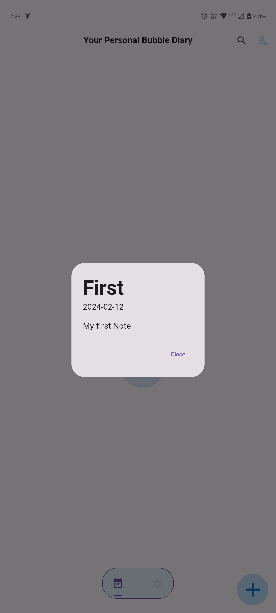

# BubbleDiary

Download the app from [here](https://github.com/CrypticCortex/BubbleDiary/releases).

Diary app reImagined! Biometric Authenticated, Uniquely crafted Diary app which stores your daily dairies at cloud (again secure :)).

My 2023 new year resolution was to write dairies daily, but I don't want to write it down with pen and paper, so my friend suggested a digital app. It did its job very well. But I couldn't continue it since there is no engaging feature in it. So this year I decided to change it :)

🔒 Made in Flutter with ❤️ 🔒

## Screenshots

Here are some screenshots of the app:

<!-- Login -->

  

<!-- Main Page -->

  

<!-- Password Reset -->

  

<!-- Reset Success -->

  

<!-- Search -->

  

<!-- Settings Page -->

  

<!-- Sign Up -->

  

<!-- View Notes -->

  

